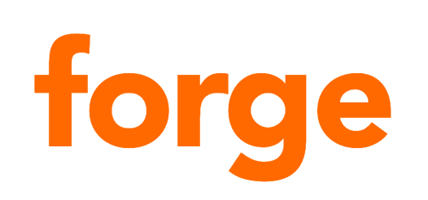
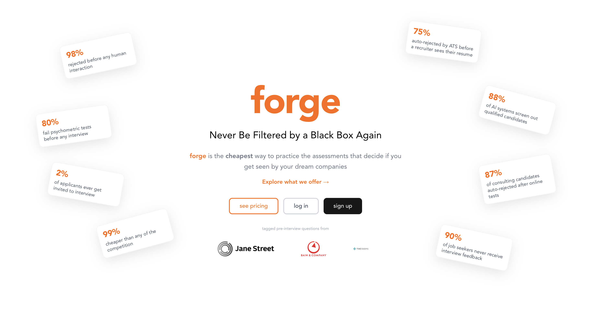
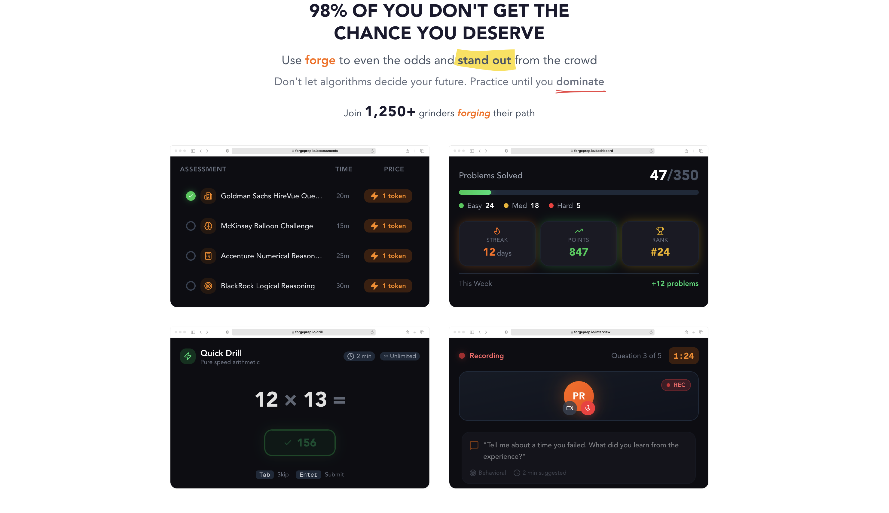
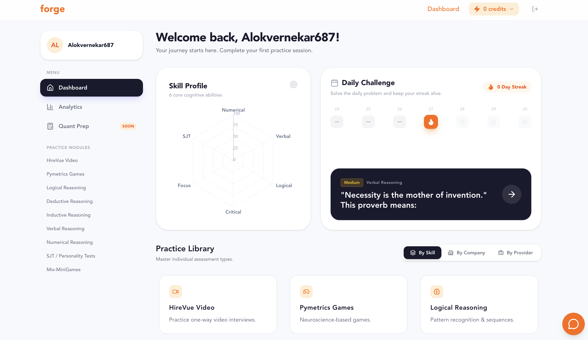

### The cheapest and most effective way to ace pre-interview assessments

**Never Be Filtered by a Black Box Again.**

Forge helps students practice the assessments that eliminate up to 98% of candidates before any human ever sees their CV — HireVue video interviews, Pymetrics games, SHL, AON, Cappfinity, Talent Q psychometric tests, and more — through an arcade-style platform with real AI feedback.

---

## 1. Team

| Name | Role |
|---|---|
| Pratham Ranjan | Co-founder |
| Amitbikram Jain | Co-founder |
| Alok Vernekar | Co-founder |
| Aditya Anand Pramod | Co-founder |

- **SEP Start Date:** August 2025
- **Contact:** [operations@forgeprep.io](mailto:operations@forgeprep.io)

---

## 2. What We're Building

### The Problem
Pre-interview screening has become a black box. Up to **98% of candidates** are rejected before any human reviews their application — automatically filtered out by video assessments, neuroscience-based games, and psychometric tests that most candidates have never practised before.

### Our Solution
**Forge** is a credit-based practice platform that lets job seekers rehearse the exact assessments used by top companies — at a fraction of the cost of any competitor. Users build real skills, track their progress across 6 cognitive dimensions, and walk into every assessment knowing exactly what to expect.

### SEP Objectives
- Launch a fully functional, paying-user platform for pre-interview assessment prep
- Build and maintain question banks across every major assessment provider (SHL, AON, Cappfinity, Talent Q, HireVue, Pymetrics)
- Grow to 1,000+ active users via NTU career events and organic channels
- Achieve first revenue through credit-based pricing model
- Establish Forge as the go-to prep tool for NTU students ahead of recruitment season

---

## 3. Product

### Key Features

| Feature | Description |
|---|---|
| **HireVue Practice** | One-way video interview prep with real questions from top companies and AI feedback on delivery and content |
| **Pymetrics Games** | All 12 neuroscience-based game simulations used by firms like BCG, JP Morgan, and Unilever |
| **SHL / AON / Cappfinity / Talent Q** | Full psychometric test suites from every major assessment provider |
| **Logical, Verbal & Numerical Reasoning** | Hundreds of tagged questions mapped to specific companies |
| **Skill Radar** | Personal skill profile tracking 6 cognitive abilities across all practice sessions |
| **Daily Challenge** | Streak-based daily problem to keep users sharp and consistent |
| **Practice by Company** | Company-specific question banks for Morgan Stanley, UBS, DBS, Bain, BlackRock, Jane Street, Two Sigma, and more |
| **AI Feedback** | Instant, actionable feedback on every response |

### Pricing
Credit-based — pay only for what you practise. No bundles, no subscriptions.

| Pack | Credits | Price |
|---|---|---|
| Starter | 5 credits | $2.99 |
| Popular | 15 credits | $7.99 |
| Best Value | 30 credits | $14.99 |

Up to 99% cheaper than competitors like Graduates First, JobTestPrep, and iPrep. Credits never expire.

### Previews

**Landing Page**

**App in Action**

### Live Links
- Website: [forgeprep.io](https://www.forgeprep.io/)

---

## 4. Development Progress

What we have shipped since August 2025:

- **Full auth system** — sign up, login, Google OAuth, onboarding flow
- **Credit & payments system** — Stripe integration, credit packs, paywall enforcement across all test pages
- **SHL suite** — numerical (12 interactive question types including pie charts, draggable graphs, stacked bars), verbal, inductive, deductive reasoning
- **AON suite** — verbal reasoning, numerical reasoning, digit challenge, concentration, grid challenge, language skills, inductive logical
- **Cappfinity suite** — numerical, critical thinking, situational judgement
- **Korn Ferry Talent Q** — adaptive logical, verbal, numerical reasoning
- **HireVue** — camera/mic video practice with AI-powered evaluation via GPT-4 and Whisper transcription
- **Pymetrics** — neuroscience game simulations
- **Skill tracking engine** — unified taxonomy mapping every question to 6 cognitive skill dimensions; personal radar chart updated after each session
- **Analytics dashboard** — per-user performance tracking across all test types
- **Daily challenge** — streak system with calendar view
- **Practice by company** — company profiles with tagged question banks pulled from Supabase
- **Recommendations engine** — surfaces weak areas and suggested next tests
- **Test report system** — detailed post-test breakdowns with answer review
- **Rate limiting & security** — API protection, payment vulnerability patched
- **Quant Prep module** — brain teasers, mental math, probability, market sizing, statistics and logic puzzles sourced from Goldman, Jane Street, Citadel and more (coming soon)
- **Deployed to production** — Vercel (frontend) + Google Cloud Run (backend)

### April – May 2026

- **Landing page demo** — replaced feature sections with a live try-before-you-buy demo; visitors can attempt real SHL-style numerical and verbal questions directly on the homepage before signing up
- **SEO overhaul** — metadata, canonical URLs, Twitter cards, sitemap, robots file, and `llms.txt` across every page to drive organic traffic
- **PostHog analytics** — product analytics integrated across the platform tracking signups, purchases, and key user actions
- **Free diagnostic assessment** — 30-question free diagnostic (10 numerical, 10 verbal, 10 logical) with full skill breakdown, score history, and personalised recommendations; no credits required
- **Learn section** — full content library at `/learn` covering numerical, verbal, logical, HireVue, Pymetrics, test strategy, time management and more; SEO-optimised
- **HireVue polished answer** — after completing a video question, users now receive an AI-rewritten version of their response showing how they could have said it better
- **Multi-country pricing** — pricing dynamically adjusts based on the user's country via Stripe
- **About page & social** — founder story, Numerical Monday and Verbal Wednesday weekly content series posted across Instagram, TikTok, and LinkedIn
- **B2B institutional demo** — analytics dashboard demo built for universities and career centres showing usage, retention, and skill progression across a user cohort
- **SHL new question types** — table classification component added; line graph, pie chart, and stacked bar chart fixes across numerical interactive tests

---

## 5. Current Status & Traction

- **Platform:** Live and fully functional at [forgeprep.io](https://www.forgeprep.io/)
- **Waitlist:** 100+ signups from the CCDS Back-to-School Fair alone
- **User Testing:** Ongoing with friends and target users to refine UX and content
- **Revenue:** Pre-revenue — credit system built and ready, awaiting full launch

---

## 6. Finance & Budget

| Item | Status |
|---|---|
| iLab SEP Grant | Received — pending marketing budget approval |
| Marketing Budget | Submitted for approval (demos provided to iLab as requested) |
| Angel Investment | None to date |
| Revenue | Pre-revenue |

---

## 7. Competitions & Events

| Event | Details |
|---|---|
| NTU TechFest Hackathon (2024) | **Winners** — invited back as sponsors and opening speakers in 2025 edition |
| CCDS Back-to-School Fair | Set up booth, 100+ waitlist signups |
| NTU Career Fairs (upcoming) | Seeking booth approval via iLab |

---

## 8. iLab SEP Progress Updates

Per iLab SEP reporting requirements, we post a 3–5 minute YouTube update every 2 months.

| Period | YouTube Update |
|---|---|
| December 2025 | [Watch](./progress/2025-12-progress.md) |
| January 2026 | [Watch](./progress/2026-01-progress.md) |
| March 2026 | [Watch](./progress/2026-03-progress.md) |
| May 2026 | [Watch](./progress/2026-05-progress.md) |

---

NTU iLab Student Entrepreneurship Programme · Nanyang Technological University

